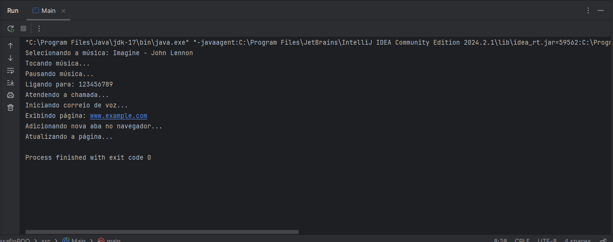
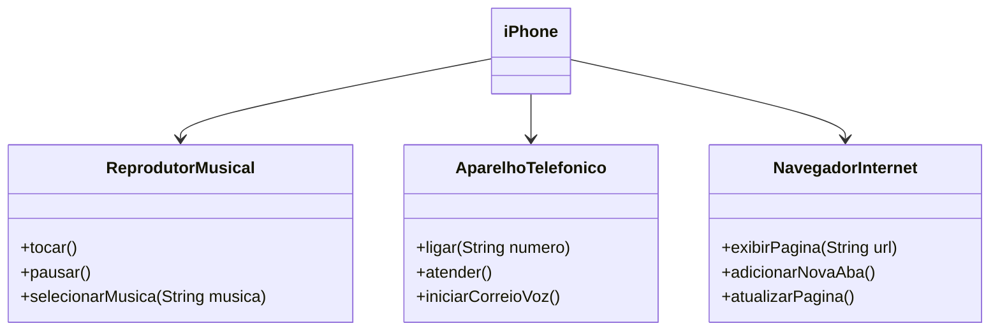

# Desafio POO - iPhone UML

Este projeto é parte do desafio de Programação Orientada a Objetos (POO), modelando o componente iPhone e suas funcionalidades, como reprodutor musical, aparelho telefônico e navegador de internet.

## Funcionalidades
- **Reprodutor Musical**: tocar, pausar, selecionar música
- **Aparelho Telefônico**: ligar, atender, iniciar correio de voz
- **Navegador de Internet**: exibir página, adicionar nova aba, atualizar página

## Evidências

Evidências do código implementado:

## UML Diagram

## Links Importantes

- [Link do Desafio](https://github.com/digitalinnovationone/trilha-java-basico/tree/main/desafios/poo)

## Contato

Estou sempre aberto a colaborações e discussões sobre qualidade de software! Vamos nos conectar!

